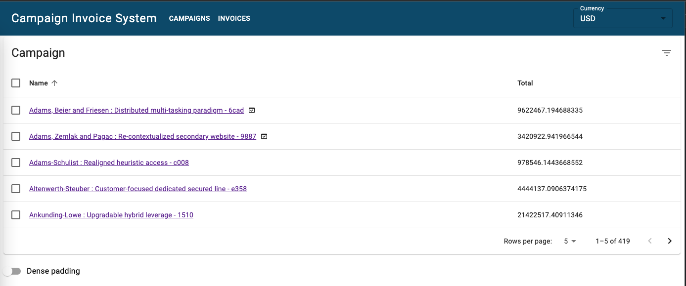
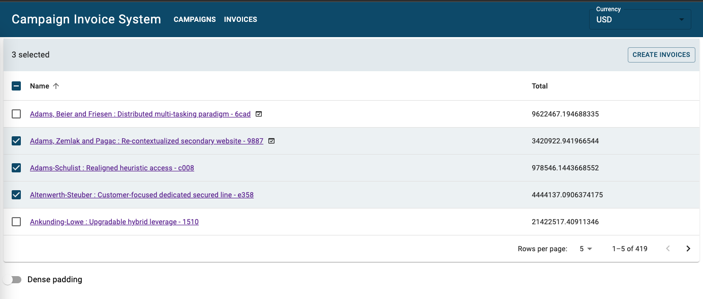
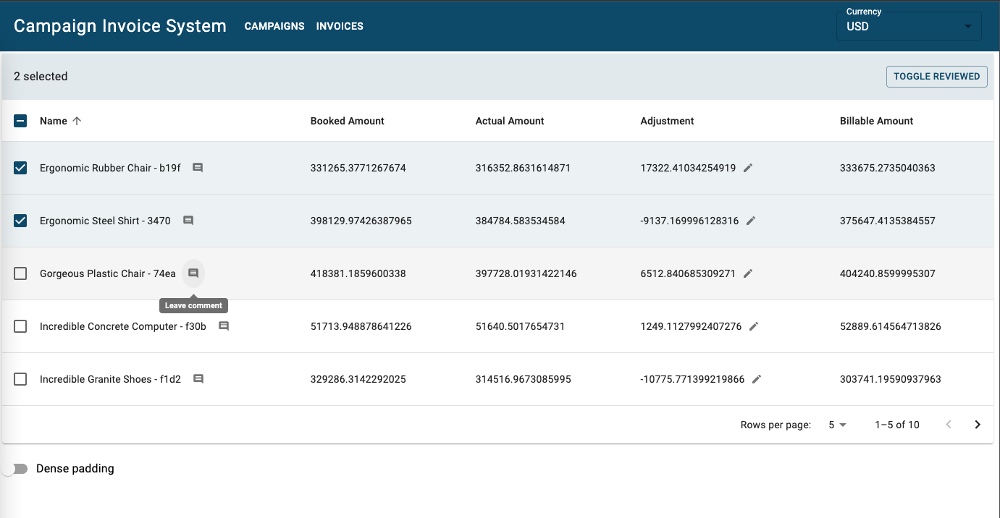
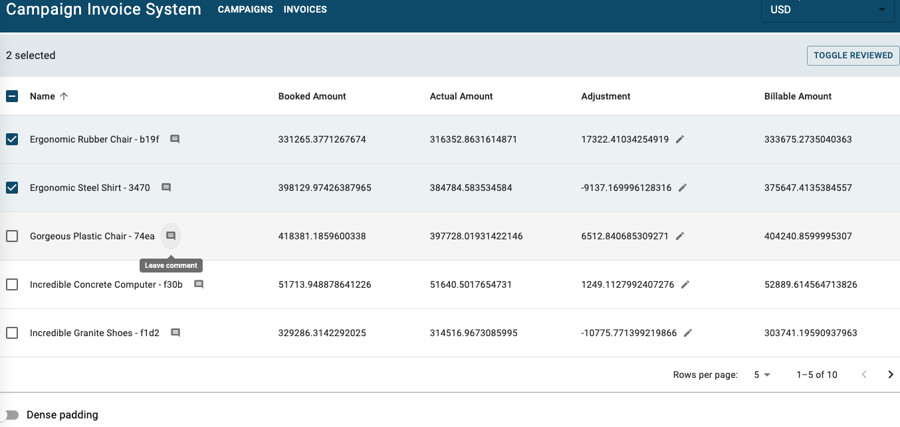
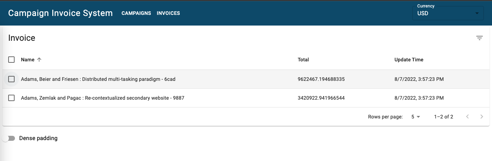
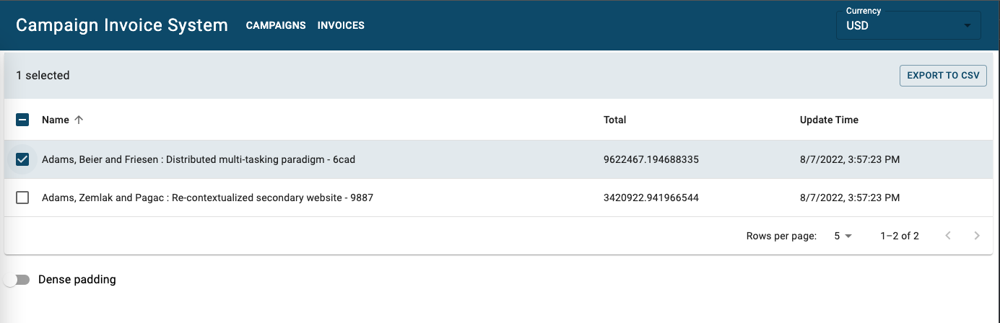
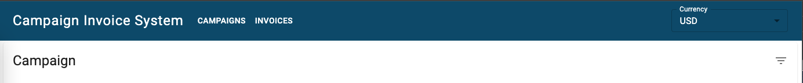
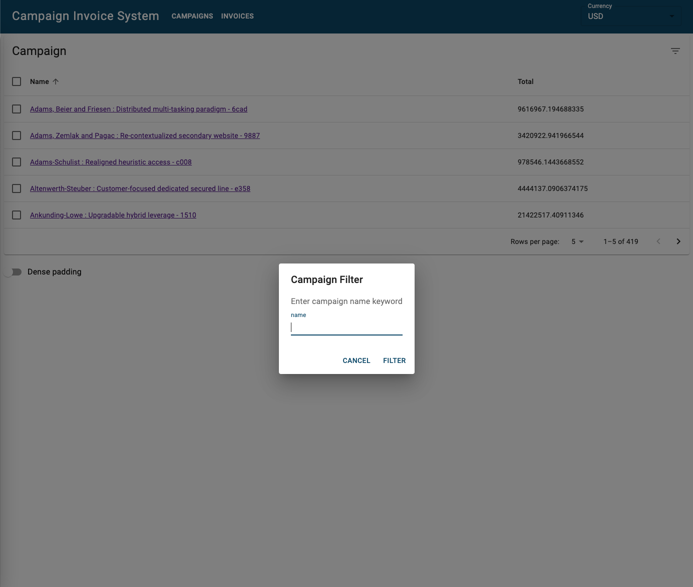

# interview_homework

This is Mike Fang's interview homework for Replacement.io.

# Demo site
https://pleacement-io-interview.herokuapp.com/

# Technical stack
* The backend uses Node.js/Express.js framework with Sqlite as Database. Sequelize is ORM
* The frontend uses React.js with Redux

# Set up preparation
1. Install Node.js & NPM (Please refer to [official document](https://nodejs.org/en/) for installation)
2. Clone the project
    ``` bash
    https://github.com/mike1026915/interview_homework.git
    ```
# Setup for running & developing app locally
1. Setup for backend app. Go to `backend` folder. Install package and start the service
    ``` bash
    cd backend
    npm install
    npm run watch
    ```
2. Setup for frontend app. Go to `frontend` folder. Install package and build production build
    ``` bash
    cd frontend
    npm install
    npm run start
    ```
Note: you may see message pop up as below. Just type `y` to continue
```
Something is already running on port 3000.
Would you like to run the app on another port instead? › (Y/n)
```

3. It will start browser and you can see the application is running in http://localhost:3003/ (the port may be different)

# App usage introduction
We have campaign page, line-item page and invoice page to list all campaigns, line-items and invoices.
* In campaign page, we show all campaigns in a table and with pagination. You can sort the table by name or by total.
Select any campaign and click the top-right "CREATE INVOICE" button to create invoices. You can see an icon next to name to indicate the campaign's invoice has been created.



* Click any campaign to go to line-item page to view all line-items under the campaign. Line-items are also presented by table with pagination. It can also sorted based on any column's data.


* Select line-items then click the top-right "TOGGLE REVIEWED" button to mark the items as reviewed.
* Clicking the pen icon in adjustment column can edit the adjustment.
* Clicking the comment icon in the named column can leave/update comment to the item
* Reviewed items is neither editable nor leaving comment.



* Click "Invoice" on top bar can go to invoice page to view generated invoices. it is also a table with pagination and can be sort based on any column.


* Select then click the top-right "EXPORT TO CSV" button to dump data to a CSV file


* On the right of app bar, we can select the currency, we only support USD/EUR for now.


* Below the currency, there is a filter icon, we can filter the data by name. We can set filter in each table.


# Completed use cases

* The user should be able browse through the line-item data as either a list or table (ie. pagination or infinite-scrolling)
    * You can click a campaign to view all line-items under a campaign
* The user should be able to edit line-item "adjustments".
    * You can click the pen icon next to adjustment to edit the line-item adjustment in line-item page
* The user should be able to see each line-item's billable amount (sub- total = actuals + adjustments).
    * Can see the billable amount in lint-item page
* The user should be able to see sub-totals grouped by campaign (line- items grouped by their parent campaign).
    * In the campaign page, we can to the campaign total information
* The user should be able to see the invoice grand-total (sum of each line-item's billable amount).
    * In campaign page, users can select the campaign then click the "CREATE INVOICE" to generate invoice. Then in the invoice page, you can see the grand-total value.
* The user should be able to sort the data.
    * In each table, use can sort the data based on each column
* The user should be able to browse/filter/sort the invoice history, as well.
